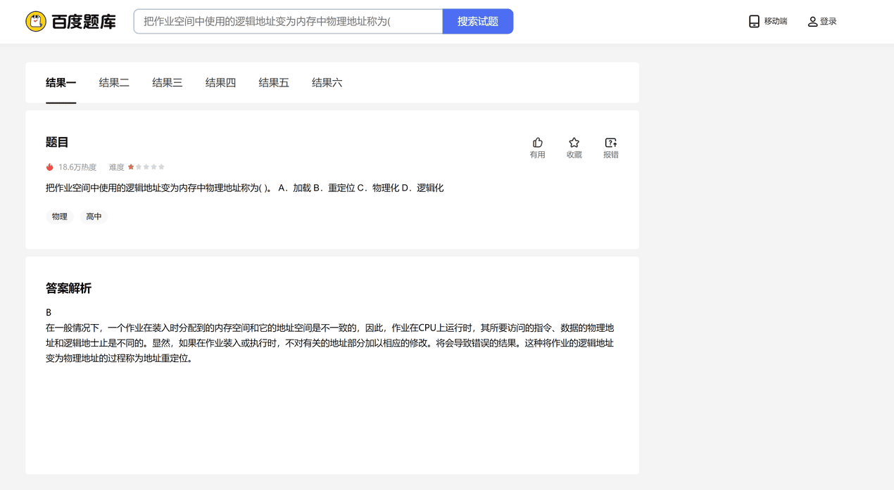

# FuckEasylearn

## 功能

 - **自动** `展开` **题干**
 - **隐藏** `题干过长时` 的遮挡块**
 - **隐藏** `查看答案及解析` 的**遮挡块**
 - **移除** `会员广告` 横幅
 - **支持隐藏** `查看本题试卷` 
 - **支持隐藏** `视频讲解` 
 - **支持隐藏** `查看本题试卷来源` 

## 使用说明

 - [基本]
   - `Google Chrome`/`Microsoft Edge`/`Cent Browser`等浏览器**油猴Tampermonkey**扩展插件
   - [点击安装本脚本](https://greasyfork.org/zh-CN/scripts/461406)

 - [扩展]
   - 点击脚本菜单，可以选择性隐藏下列内容
     - `查看本题试卷` (默认开启)
     - `视频讲解` (默认开启)
     - `查看本题试卷来源` (默认开启)

## 注意事项

 - 本脚本仅作用于**百度题库**页面

## 声明

 - **本脚本所造成的一切损失，均由使用者自行承担。**

## 使用效果对比图

 | 
---|---
